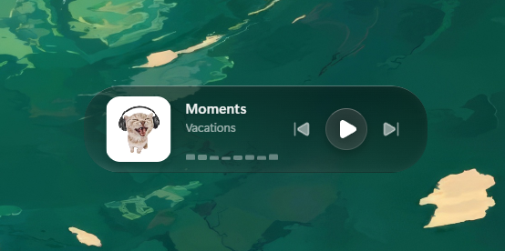

# 🎵 Glass Widget Media Player

Un widget de control de música moderno y minimalista construido con Tauri, React y TypeScript, con un elegante diseño glassmórfico.
Basicamente la aplicación hace una sincronización en tiempo real con el Media Manager de Windows para obtener lo que se está 
reproduciendo 


## ✨ Características

- 💻 Funciona con Spotify, YouTube Music, Navegador o Reproductor nativo de windows.
- 🎶 Interfaz moderna con efecto glassmorphism
- ⚡ Construido con Tauri para rendimiento nativo
- 🎨 Diseño responsivo que se adapta a cualquier tamaño de pantalla
- 🔄 Controles de reproducción de música en tiempo real
- 🎧 Visualización de audio con barras animadas tipo “wave”
- 🚀 Ligero y muy rápido

## 🛠️ Stack Tecnológico

- **Frontend**: React 19 + TypeScript
- **UI**: CSS vanilla personalizado con efectos glassmórficos
- **Íconos**: Lucide Icons
- **Herramienta de build**: Vite
- **Escritorio**: Tauri (para aplicaciones de escritorio multiplataforma)

## 🚀 Primeros Pasos

### Requisitos previos

- Node.js (v16 o superior) https://nodejs.org/es
- Rust (para desarrollo con Tauri) https://rust-lang.org/es/

### Instalación

1. Clona el repositorio
   ```bash
   git clone https://github.com/yourusername/glass-widget.git
   cd glass-widget

2. Instala las dependencias
    ```bash
    npm install

3. Inicia el servidor de desarrollo
    ```bash
    npm run tauri dev

4. Build para producción
    ```bash
    npm run tauri build 

5. Estructura del proyecto
   ```bash
   glass-widget/
├── src/                  # Código fuente de la aplicación React
│   ├── assets/           # Recursos estáticos (imágenes, fuentes, etc.)
│   ├── App.tsx           # Componente principal de la aplicación
│   ├── main.tsx          # Punto de entrada de la aplicación
│   └── App.css           # Estilos globales
├── src-tauri/            # Configuración de Tauri
│   ├── src/
│   │   └── main.rs       # Punto de entrada de la app Tauri
│   └── tauri.conf.json   # Configuración de Tauri
├── public/               # Recursos públicos
├── index.html            # HTML principal
└── package.json          # Dependencias y scripts del proyecto

